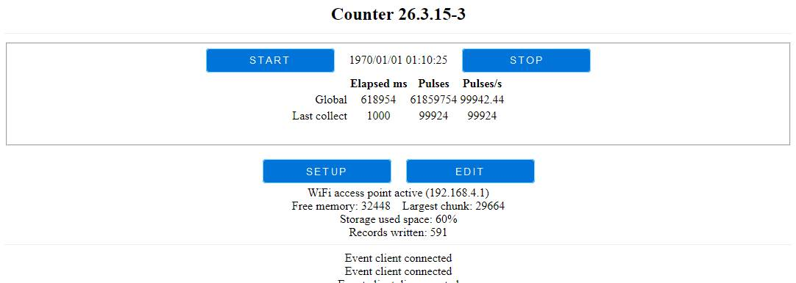
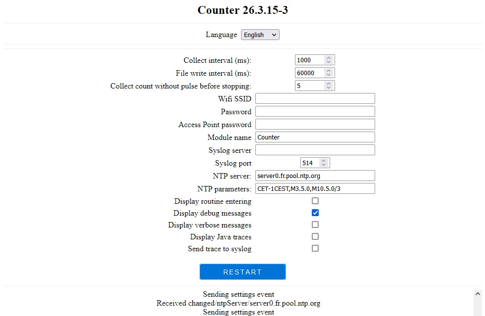
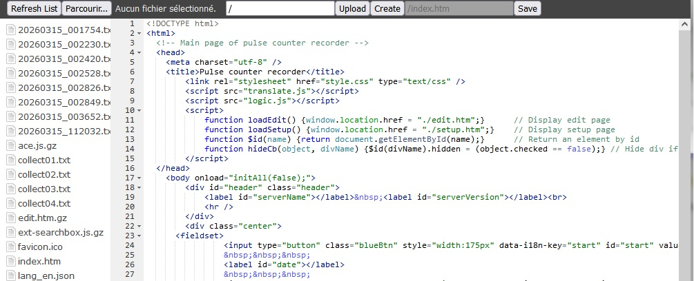
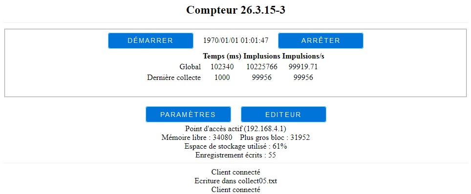
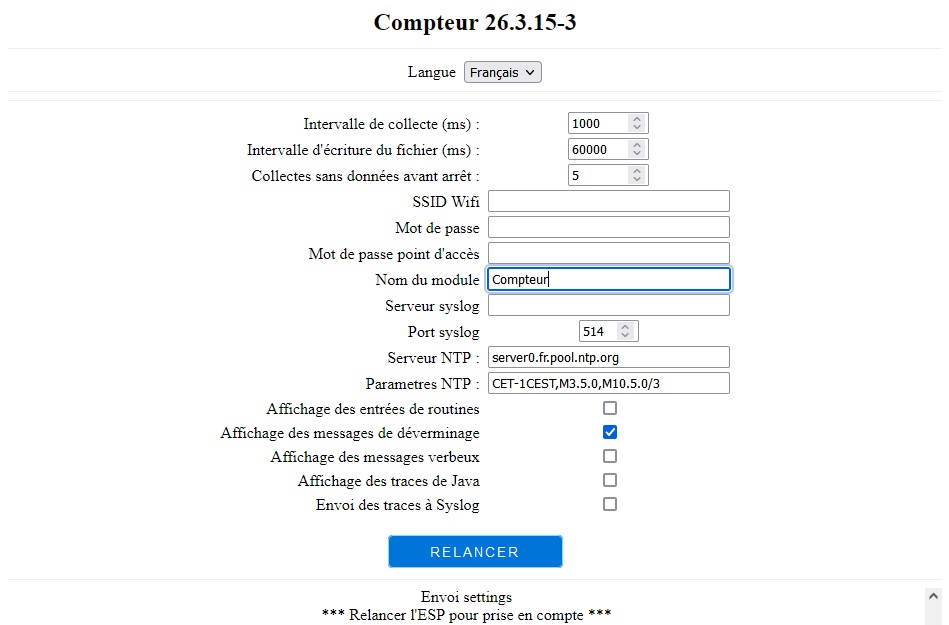

# English: Pulse counter recorder/Enregistreur d'impulsions

[Cliquez ici pour la version française plus bas dans ce document](#france)

# <a id="english">English version</a>

## Presentation

This code uses an ESP8266 or an ESP32 to count pulses of a contact or a signal, at regular interval, and write it to a file under TXT format, with <TAB> as separator. It was originally design to monitor a motor speed over time, but can be used to register evolution of anything that can send pulse, up to at least 100 kHz thanks to interruption managed counter.

An embedded web server sets some parameters and see/download TXT file from module.

## Connections to module

Module uses a pin to read external signal. By default, we use `D2`, but you can set any pin changing `INTERRUPT_PIN` in platformio.ini file (or in .INO file header if platformio.ini is not used or doesn't  define `INTERRUPT_PIN`).

By default again, input mode is set to `INPUT` but you can set it to `INPUT_PULLUP` changing `INTERRUPT_PIN_MODE` in the same file.

Then, interrupt level can be set to one of `FAILLING`, `RAISING` or `BOTH` into `INTERRUPT_PIN_LEVEL` (default to `FAILLING`, meaning a transition from `HIGH` to `LOW`).

## Data capture principles

Each change on `INTERRUPT_PIN` is counted, as specified into `INTERRUPT_PIN_LEVEL`.

A line of data is saved into memory at regular interval (known as `Collect interval (ms)` described later on). By default, this is set to one second, but you can change it depending on signal evolution speed.

Data is written to a file, saved into module's flash every `File write interval (ms)`, set by default to a minute, but again adjustable to your needs to avoid too many writes on flash. Data will also be written as soon as recording stops.

Data will also be written on flash when it'll become full (by default, we can keep up to 300 samples, but you can modify it into code on `#define MEMORY_ARRAY_SIZE`).

Web server allow then to download file on a PC.

File name depends on module's knowledge of date and time. If NTP server been defined (see later), and is available, then local time will be used, formated as `YYYYMMDD_HHMMSS`. Else `captureNN` format will be used, with `NN` between `01` and `99`, first not yet used as file name being selected.

File type will be `.txt`.

After a header, each data line will be written as `<milliseconds elapsed since capture start>`, followed by a tabulation character `<TAB>` and count of pulses seen since previous line.

## Languages

Code supports English and French languages.

User's language is set by browser. If browser supports French as primary language, then web pages will be displayed in French, else in English.

Server's language is defined at compilation time. It will be French if `VERSION_FRANCAISE` is defined, English else.

## Embedded Web server

Interaction between user and ESP is done through an embedded web server, using a browser from a smart-phone or a computed.

Address to use depend on parameters given by user.

In most common case, where module is not connected to an existing WiFi, you have to connect smart-phone or computer to module internal access point (with default values, it's named `Counter_xxxxxx` where `xxxxxx` is last 6 characters of ESP MAC address). You have to connect then by `http://192.168.4.1/`

If you gave a WiFi SSID (which has been joined in the first 10 seconds of module life), you'll be connected to this network, and IP given by this network's router.

In all cases, network name and IP to use will be written on USB ESP console port at start.

## Home page

Home page (`/` or `/index.htm`) looks like this:

First line contains module's name and version

Next frame contains `Start` and `Stop` buttons, to active data capture. 

Current date is inserted between the 2 buttons. If an NTP server is defined and accessible, it will display current local time. Else, this will be some date in 1970.

Just under, we have a table with 3 columns (elapsed time in milliseconds since start, Count of pulses seen and average pulses per seconds over the interval). First row is capture global data, while second row display only last collect interval data.

Under this frame, we have `Setup` and `Edit` buttons, allowing to access module parameters and file system editor.

We then have information about WiFi (either access point or client), information about memory, percentage of used flash space and count of written into local file.

Last frame contains messages sent by module and/or browser.

## Settings pages

When clicking on `Setup` button on main page, you'll switch to this page:

The following parameters can be set here:
- Collect interval (ms): number of milliseconds between 2 collects. The shorted it is, the more lines you'll have into file. To get an idea, available space is around 500 kB on flash, giving around 35.000 captures in total.
- File write interval (ms): interval to wait before writing data to file. Making it long will reduce number of write, increasing flash life. 
- Collect count without pulse before stopping: recording will stop after having this count if interval without any pulse. Set it to zero if you don't want to stop collection (in this case, all intervals without data will have a line with zero value).
- WiFi SSID: Set SSID of an existing WiFi you want to connect to. Note that module will automatically switch to local access point if not set, or WiFi not reachable within 10 seconds after module starts.
- Password: Give SSID password for existing WiFi network to connect to. Let it empty if not used/needed.
- Access Point password: password to associate access point to when activated.
- Module name: give this module a network name.
- Syslog server: if needed, messages generated by this module can be sent to a syslog server. Give its name here if used.
- Syslog port: syslog port to be used (default to 514)
- NTP server: if needed, module can get time from Internet. It will be displayed and used in file naming. Give either IP address or DNS name.
- NTP parameters: give NTP time zone parameters. For example, daylight saving time for France is `CET-1CEST,M3.5.0,M10.5.0/3`.
- Display routine entering: tick it to trace routine entering (used to debug).
- Display debug messages: tick it  to display debug message (used to debug).
- Display verbose messages: tick it to display more messages.
- Display Java trace: tick it to display Java messages (used to debug)
- Send trace to syslog: tick it to send messages to syslog

In addition, `Restart` button allows to reboot the module after a change needing a restart (mainly WiFi settings).

Last frame contains messages sent by module and/or browser.

## File editor page

When clicking on `Edit` button on main page, you'll switch to this page:

It displays list of file on ESP in the left part, allows to modify, delete, download files, create an empty file or load a file from computer or smart-phone.

Use it to download a capture file (names are either formated as date using `YYYYMMDD_HHMMSS.txt or `collectNN.txt`). To download a file, right-click on its name and select `Download`. To visualize a file, just click on its name.

You may also change file content, and even upload a file from PC to module (which indeed is useless but available ;-)

## Web server supported requests

Embedded web server answer to the following URL:

- `/` : display home page,
- `/status` : returns program state as JSON data,
- `/setup` : display setup page,
- `/settings` : returns parameters as JSON data,
- `/debug` : returns internal variables to debug,
- `/log` : returns last saved log lignes,
- `/edit` : manages and edit file system,
- `/rest/restart` : restarts ESP,
- `/command/enable/enter` : arms `Display routing entering` flag,
- `/command/enable/debug` : arms `Display debug messages` flag,
- `/command/enable/verbose` : arms `Display verbose messages` flag,
- `/command/enable/java` : arms `Display Java traces` flag,
- `/command/enable/syslog` : arms `Send traces to syslog` flag,
- `/command/disable/enter` : disarms `Display routing entering` flag,
- `/command/disable/debug` : disarms `Display debug messages` flag,
- `/command/disable/verbose` : disarms `Display verbose messages` flag,
- `/command/disable/java` : disarms `Display Java traces` flag,
- `/command/disable/syslog` : disarms `Send traces to syslog` flag,
- `/languages` : Returns supported languages list,
- `/changed` : change value of a variables (internal use),

# <a id="france">Version française</a>
## Présentation

Ce code utilise un ESP8266 ou un ESP32 pour compter des impulsions d'un contact ou d'un signal à intervalle régulier pour l'écrire dans un fichier au format TXT, avec un séparateur <TAB>. Il a été initialement écrit pour surveiller la vitesse de rotation d'un moteur, mais peut être utilisé pour enregistrer les variations de n'importe quel appareil générant des impulsions, jusqu'à au moins 100 kHz grâce à un compteur géré par interruptions.

Un serveur web embarqué permet de fixer quelques paramètres et de voir/télécharger les fichiers TXT du module.

## Connexions au module

Le module utilise une pinoche pour lire le signal extérieur. Par défaut, on utilise `D2`, mais on peut utiliser une autre pinoche en changeant `INTERRUPT_PIN` dans le fichier platformio.ini file (ou dans le code du .INO si platformio.ini file n'est pas utilisé, ou ne définit pas `INTERRUPT_PIN`).

Par défaut, le mode de la pinoche est `INPUT` mais vous pouvez le modifier en `INPUT_PULLUP` en changeant `INTERRUPT_PIN_MODE` au même endroit.

Finalement, le niveau d'interruption peut être défini à `FAILLING`, `RAISING` ou `BOTH` dans `INTERRUPT_PIN_LEVEL` (par défaut `FAILLING`, correspondant à une transition de `HIGH` à `LOW`).

## Principes de capture des données

Chaque changement sur `INTERRUPT_PIN` est compté, comme spécifié dans `INTERRUPT_PIN_LEVEL`.

Une ligne de donnée est conservé en mémoire à intervalle régulier (défini dans `Intervalle de collecte (ms)` décrit plus loin). Par défaut, il est défini sur une seconde, mais vous pouvez le modifier en fonction de la vitesse d'évolution du signal.

Les données mémorisées sont écrite dans un fichier localisé dans la flash chaque `Intervalle d'écriture du fichier (ms)`, défini par défaut à une minute, mais vous pouvez l'adapter à vos besoins pour limiter trop d'accès à la flash. Les données seront également écrite des l'arrêt de l'enregistrement.

Les données sont également écrites lorsque la mémoire est pleine (par défaut, on peut mémoriser de façon interne jusqu'à 300 messages, mais vous pouvez le modifier dans `#define MEMORY_ARRAY_SIZE`).

Le Web serveur interne permet alors de télécharger le fichier.

Le nom de fichier dépend de la connaissance de la date et de l'heure. Si un serveur NTP a été défini, et qu'il est accessible, alors on utiliser l'heure locale, formattée `AAAAMMJJ_HHMMSS`. Sinon, on utiliser `captureNN`, avec `NN` entre `01` et `99`, le premier non existant sur le module étant utilisé.

L'extension du fichier sera `.txt`.

Après une entête, chaque ligne de données sera écrite selon `<millisecondes écoulées depuis le début de la capture>`, suivi d'un caractère tabulation `<TAB>` et du `<nombre d'impulsions vues depuis la ligne précédente>`.

## Langues

Le code supporte le français et l'anglais.

La langue de l'utilisateur est donnée par le navigateur. S'il supporte le français en langue primaire, alors les pages Web seront affichées en français, sinon en anglais.

La langue du serveur est définie à la compilation. On utilisera le français si `VERSION_FRANCAISE` est définie, l'anglais sinon.

## Le serveur Web embarqué

L'interaction entre l'utilisateur et l'ESP s'effectue au travers d'un serveur Web embarqué, à l'aide d'un navigateur Web, depuis un téléphone ou un ordinateur.

L'adresse à utiliser dépend du paramétrage fait par l'utilisateur.

Dans le cas le plus courant où le module n'est pas connecté à un réseau WiFi existant, il faut connecter le téléphone ou l'ordinateur au réseau WiFi du module (avec les valeurs par défaut, il se nomme `Eclairage_xxxxxx` où `xxxxxx` représente la fin de l'adresse MAC du module). On se connecte alors au serveur par `http://192.168.4.1/`

Si on a précisé un réseau WiFi (et que celui-ci a pu être joint au démarrage du module), on sera alors connecté à ce réseau, et c'est le routeur du réseau qui lui affectera son adresse IP.

Dans tous les cas, le nom du réseau et l'IP à utiliser sont affichés sur le port console (USB) de l'ESP au lancement.

## La page d'accueil

La page d'accueil (`/` or `/index.htm`) ressemble à :

La première ligne contient le nom du module et son numéro de version.

La trame suivante contient les boutons `Démarrer` et `Arrêter` pour contrôler la capture.

La date courante est insérée entre les 2 boutons. Si un serveur NTP est défini et accessible, on utilisera la date locale. Sinon, la date sera dans les années 1970.

Juste en dessous, on trouve une table avec 3 colonnes (temps écoulé en millisecondes depuis le début de la capture, nombre d'impulsion vues et nombre d'impulsions par seconde sur l'intervalle). La première ligne concerne la globalité de la capture, alors que la seconde concerne le dernier intervalle de collecte.

Sous cette trame, on trouve les boutons `Paramètres` et `Editeur`, permettant d'accéder aux paramètres du module et à l'éditeur du système de fichier intégré.

On a ensuite les informations sur le WiFi (qu'il soit point d'accès ou client), des informations sur la mémoire, le pourcentage de flash utilisé et le nombre d'enregistrements écrits dans le fichier.

La dernière trame contient les messages émis par le module ou le navigateur.

## La page des paramètres du module

Lorsqu'on clique sur le bouton `Paramètres` de la page principale, on bascule sur cette page :

Les paramètres suivants peuvent être définis ici :
- Intervalle de collecte (ms) : nombre de millisecondes entre 2 collectes. Plus il est court, plus de lignes vous aurez dans le fichier. Pour donner une idée, on a environ 500 kB de flash disponible, ce qui donne environ 35 000 captures en tout.
- Intervalle d'écriture du fichier (ms) : intervalle entre 2 écritures de fichier. L4allonger va réduire le nombre d'écritures, et allonger la durée de vie de la flash.
- Collectes sans données avant arrêt : nombre de collectes sans impulsions avant de l'arrêter. Mettez-le à zéro si vous ne souhaitez pas arrêter la collecte (dans ce cas, tous les captures sans données généreront une ligne avec une valeur à zéro.
- SSID Wifi : Donner le SSID du réseau WiFi existant auquel se connecter. Noter que le module activera automatiquement sur un point d'accès local si non défini, ou pas accessible durant les 10 premières secondes de la vie du module.
- Mot de passe : indiquez le mot de passe du WiFi existant auquel se connecter. Laisser vide si pas utilisé/nécessaire.
- Mot de passe point d'accès : mot de passe associé au point d'accès quand il est activé.
- Nom du module : donnez un nom réseau au module.
- Serveur syslog : si besoin, les messages générés par ce module peuvent être envoyés sur un serveur syslog. Donnez son nom ici si utilisé.
- Port syslog : port du serveur syslog (514 par défaut)
- Serveur NTP : si besoin, le module peut récupérer la date et l'heure depuis Internet. Il sera affiché et utilisé dans le nommage des fichiers. Donnez soit l'address IP du serveur, soit son nom DNS.
- Paramètres NTP : indiquez les paramètre du fuseau horaire NTP. PAr exemple, ceux pour la France sont `CET-1CEST,M3.5.0,M10.5.0/3`.
- Affichage des entrées de routines : cochez pour afficher le nom des principales routines utilisées par le module.
- Affichage des messages de déverminage : fait ce qu'on pense qu'il va faire.
- Affichage des messages verbeux : pour ajouter plus de messages à la trace.
- Affichage des traces Java : pour afficher des messages de trace des modules JavaScript.
- Envoi des traces à Syslog : pour d'activer l'envoi des traces au serveur syslog.

De plus, le bouton `Redémarrer` permet de relancer le module après un changement nécessitant un redémarrage (principalement les paramètres WiFi).

La dernière trame contient les messages émis par le module ou le navigateur.

## La page d'édition du système de fichiers interne

Lorsqu'on clique sur le bouton `Editeur` sur la page d'accueil, on bascule sur une page telle que :

Elle affiche la liste des fichiers sur l'ESP dans la partie gauche, permettant de modifier, détruire, télécharger des fichiers, créer un fichier vide, ou charger un fichier depuis un PC ou un téléphone.

Utilisez-la pour télécharger un fichier de capture (les noms ont pour un format date tel que `AAAAMMJJ_HHMMSS.txt ou `collectNN.txt`). Pour télécharger le fichier, faire un clic droit sur son nom et choisir `Download`. Pour visualiser le fichier, simplement cliquer sur son nom.

Vous pouvez également modifier le contenu d'un fichier, et même télécharer un fichier de^puis un PC ou un téléphone vers le module (même si c'est pas très utile ;-)

## Les requêtes supportées par le serveur Web

Le serveur Web embarqué répond aux URL suivantes :

- `/` : affiche la page d'accueil,
- `/status` : retourne l'état du programme sous forme JSON,
- `/setup` : affiche la page de paramètres,
- `/settings` : retourne la paramètres au format JSON,
- `/debug` : retourne les variables internes pour déverminer,
- `/log` : retourne les dernières lignes du log mémorisé,
- `/edit` : gère et édite le système de fichier,
- `/rest/restart` : redémarre l'ESP,
- `/command/enable/enter` : arme l'indicateur `Affichage des entrées de routines`,
- `/command/enable/debug` : arme l'indicateur `Affichage des messages de déverminage`,
- `/command/enable/verbose` : arme l'indicateur `Affichage des messages verbeux`,
- `/command/enable/java` : arme l'indicateur `Affichage des traces Java`,
- `/command/enable/syslog` : arme l'indicateur `Envoi des traces à syslog`,
- `/command/disable/enter` : désarme l'indicateur `Affichage des entrées de routines`,
- `/command/disable/debug` : désarme l'indicateur `Affichage des messages de déverminage`,
- `/command/disable/verbose` : désarme l'indicateur `Affichage des messages verbeux`,
- `/command/disable/java` : désarme l'indicateur `Affichage des traces Java`,
- `/command/disable/syslog` : désarme l'indicateur `Envoi des traces à syslog`,
- `/languages` : Retourne la liste des langues supportées,
- `/changed` : change la valeur d'une variable (utilisation interne),
